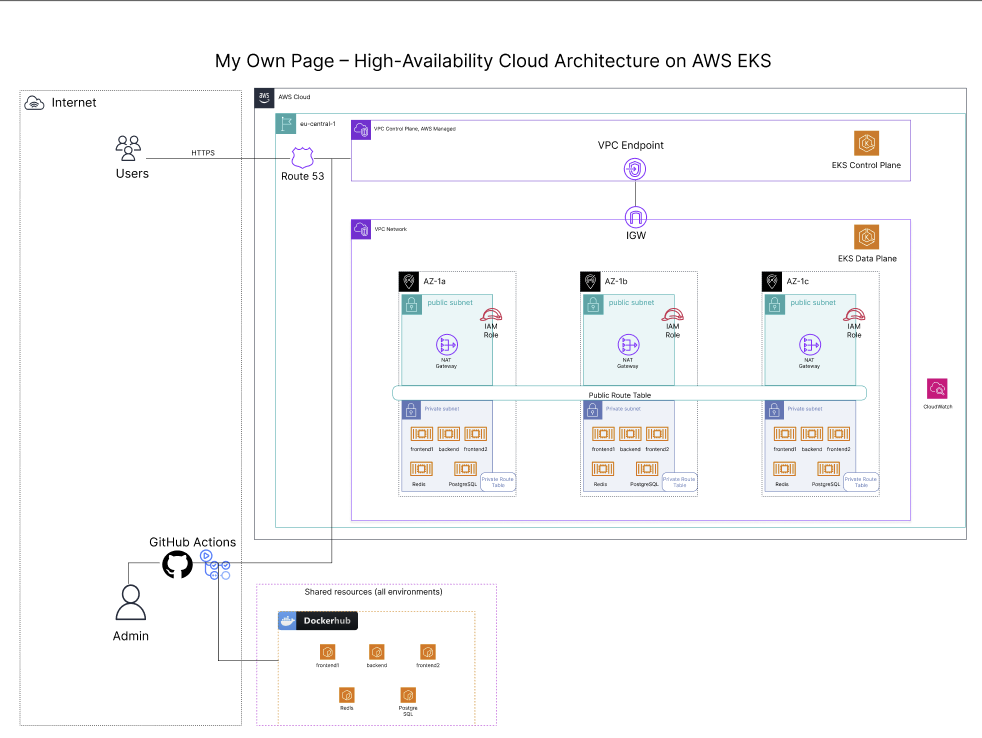

# MyOwnPage

> Create and publish tailored profile pages for every job application.  
> Each publish generates a unique public URL — share a fresh link with every employer.

---

## Cloud Architecture



The application runs on **AWS EKS** across three Availability Zones with an nginx Ingress Controller exposing a single public LoadBalancer endpoint. All services are Kubernetes Deployments with health probes, resource limits, and non-root security contexts.

| Layer | Technology |
|-------|-----------|
| DNS | Route 53 CNAME → ELB |
| Ingress | nginx Ingress Controller (AWS Classic Load Balancer) |
| Container orchestration | Amazon EKS (managed node group) |
| Image registry | Docker Hub |
| CI/CD | GitHub Actions — branch `dev` |
| Storage | Amazon EBS (gp2) via EBS CSI Driver |

---

## Application Services

```
Browser ──► nginx Ingress (LoadBalancer :80)
               │
               ├── /app/*      ──► frontend1  (Flask :5001)  Dashboard
               ├── /api/*      ──► backend    (FastAPI :8000) JSON API
               └── /<slug>     ──► frontend2  (Flask :5002)  Public profiles
                                       │
                              ┌────────┴────────┐
                              │                 │
                         PostgreSQL          Redis
                       (profiles +       (drafts, 7d TTL)
                        versions)
```

| Service | Port | Role |
|---------|------|------|
| backend | 8000 | FastAPI REST API — no HTML, JSON only |
| frontend1 | 5001 | Flask dashboard — register, login, create and edit profiles |
| frontend2 | 5002 | Flask public renderer — displays published profiles by token |
| postgres | 5432 | Profile data and version history (EBS persistent volume) |
| redis | 6379 | Draft storage with 7-day TTL (ephemeral, in-memory) |

---

## CI/CD Pipeline

Push to branch `dev` triggers three sequential jobs:

```
test  ──►  build (matrix: 3 images)  ──►  deploy
```

| Job | What it does |
|-----|-------------|
| **test** | Runs `pytest` against a live postgres + redis service container |
| **build** | Builds and pushes Docker images to Docker Hub tagged with `git sha` and `latest` |
| **deploy** | Connects to EKS, installs EBS CSI Driver + nginx Ingress Controller (idempotent), applies all k8s manifests, waits for rollouts |

All secrets are injected at deploy time from GitHub Secrets via `envsubst` — no credentials are stored in the repository.

### Required GitHub Secrets

| Secret | Description |
|--------|-------------|
| `AWS_REGION` | e.g. `eu-central-1` |
| `EKS_CLUSTER_NAME` | EKS cluster name |
| `K8S_NAMESPACE` | Kubernetes namespace |
| `AWS_ACCESS_KEY_ID` | IAM user key (needs `eks:DescribeCluster` + kubectl RBAC) |
| `AWS_SECRET_ACCESS_KEY` | IAM user secret |
| `DOCKERHUB_USERNAME` | Docker Hub username |
| `DOCKERHUB_TOKEN` | Docker Hub access token |
| `POSTGRES_PASSWORD` | Strong random password for PostgreSQL |
| `JWT_SECRET_KEY` | Random 32+ char string for JWT signing |
| `FRONTEND1_SECRET_KEY` | Random 32+ char Flask session key |
| `FRONTEND2_SECRET_KEY` | Random 32+ char Flask session key |

Generate secrets with:
```bash
python3 -c "import secrets; print(secrets.token_hex(32))"
```

### One-time AWS setup (before first deploy)

Attach the EBS CSI policy to the EKS node group IAM role:
```bash
aws iam attach-role-policy \
  --role-name <NODE_GROUP_ROLE_NAME> \
  --policy-arn arn:aws:iam::aws:policy/service-role/AmazonEBSCSIDriverPolicy
```

### HTTPS (TLS)

The Ingress is configured for **plofile.diogohack.shop** with HTTP→HTTPS redirect. Put the TLS certificate in a Secret in the same namespace as the app:

```bash
kubectl create secret tls myownpage-tls \
  --cert=path/to/fullchain.pem \
  --key=path/to/privkey.pem \
  -n "$K8S_NAMESPACE"
```

Or use [cert-manager](https://cert-manager.io/) with a `Certificate` that sets `secretName: myownpage-tls`. After the secret exists, the next deploy will enable HTTPS and redirect HTTP to HTTPS.

---

## Local Development

```bash
cp .env.example .env
# Edit .env — set POSTGRES_PASSWORD, JWT_SECRET_KEY, FRONTEND1_SECRET_KEY

docker compose up --build
```

| URL | Description |
|-----|-------------|
| `http://localhost/app` | Dashboard |
| `http://localhost/api/docs` | Swagger UI |
| `http://localhost/<slug>-<token>` | Public profile |

### Run tests

```bash
cd backend
pip install -r requirements.txt
pytest tests/ -v
```

---

## Kubernetes Manifests

```
k8s/
├── backend/        configmap, secrets, deployment, service
├── db/             configmap, secret, pvc, deployment, service
├── frontend1/      configmap, secrets, deployment, service
├── frontend2/      configmap, secrets, deployment, service
├── redis/          deployment, service
└── ingress.yaml
```

Deployments use `${DOCKERHUB_USERNAME}/${IMAGE}:${IMAGE_TAG}` placeholders — substituted by `envsubst` during deploy. Secrets use the same pattern for all sensitive values.

---

## API Reference

Base URL: `/api`  
Interactive docs: `/api/docs`

### Auth

| Method | Path | Body |
|--------|------|------|
| POST | `/auth/register` | `{email, username, password}` |
| POST | `/auth/login` | `{email, password}` → `{access_token, refresh_token}` |
| POST | `/auth/refresh` | `{refresh_token}` |
| POST | `/auth/logout` | — |

### Profiles _(Bearer token required)_

| Method | Path | Description |
|--------|------|-------------|
| POST | `/profiles` | Create profile |
| GET | `/profiles` | List all profiles |
| GET | `/profiles/<id>` | Profile detail + version history |
| PATCH | `/profiles/<id>` | Update name / company note |
| GET | `/profiles/<id>/draft` | Load draft from Redis |
| PUT | `/profiles/<id>/draft` | Save draft to Redis |
| DELETE | `/profiles/<id>/draft` | Delete draft |
| POST | `/profiles/<id>/publish` | Publish draft → new version, returns `{public_url, token}` |
| GET | `/profiles/<id>/versions` | List all published versions |

### Public _(no auth)_

| Method | Path | Description |
|--------|------|-------------|
| GET | `/public/<token>` | Returns profile JSON for the public page |

---

## Database Migrations

Migrations run automatically at container startup via `entrypoint.sh`.

```bash
# Generate a new migration after model changes
docker compose exec backend alembic revision --autogenerate -m "description"

# Rollback one step
docker compose exec backend alembic downgrade -1
```

---

## Project Structure

```
my_own_page_v4/
├── backend/            FastAPI app, Alembic migrations, tests
├── frontend1/          Flask dashboard (auth + editor)
├── frontend2/          Flask public profile renderer
├── k8s/                Kubernetes manifests
├── reverse-proxy/      nginx config for local docker-compose
├── docs/               Architecture diagram
├── .github/workflows/  CI/CD pipeline
├── docker-compose.yaml Local development
└── .env.example        Environment variable reference
```
